# Boilerplate

Projects created with flutter

# Requirements
1. [Flutter](https://flutter.dev/docs/get-started/install)
2. [Android Studio](https://developer.android.com/studio)

# Android Apk
**https://github.com/stdioh321/flutter-test/releases**

# Setup
```
$ git clone https://github.com/stdioh321/flutter-test.git
$ cd flutter-test/boilerplate
```
# Run
```
$ flutter clean
$ flutter pub get
$ flutter run
```
Home|Dark Mode
:-:|:-:
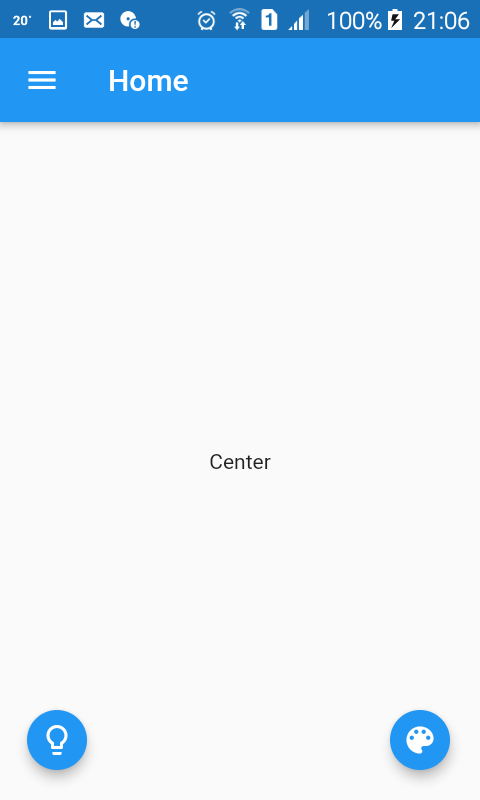 | 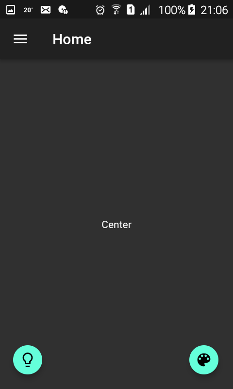

List|Drawer
:-:|:-:|
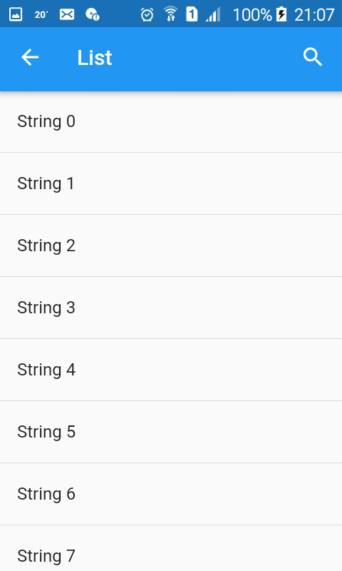 | 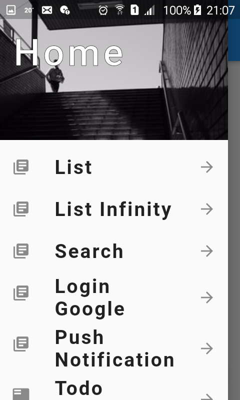 

Search|List infinity
:-:|:-:|
 | 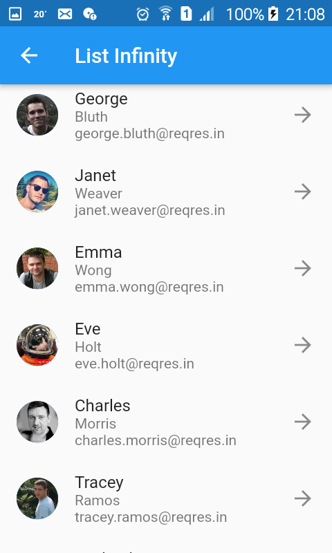 

Login Google|Push Notification
:-:|:-:|
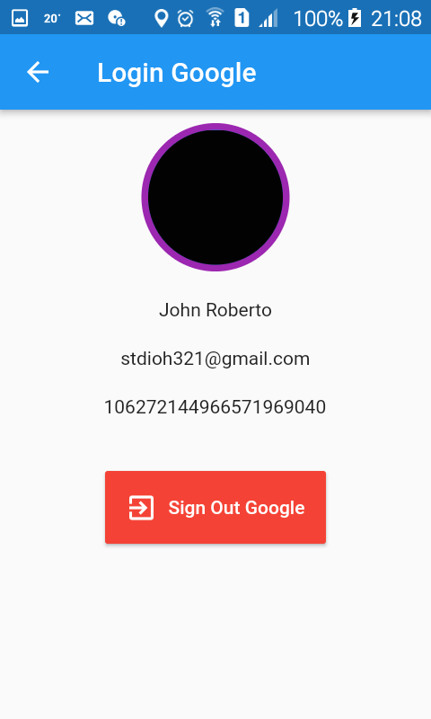 | 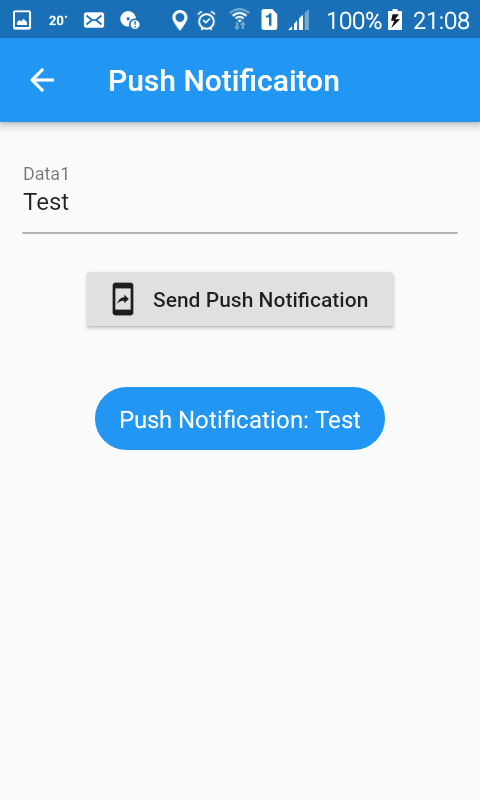 

Todo|Tmp
:-:|:-:|
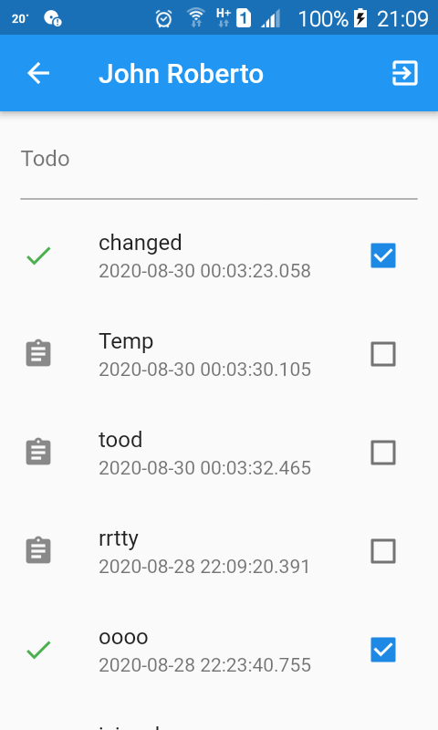 | 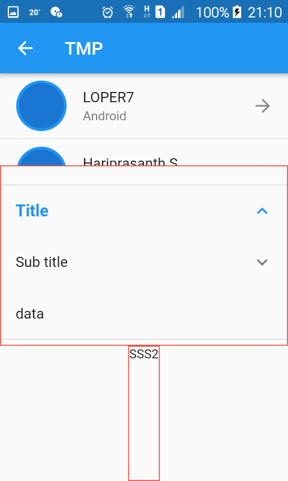 

List Files|Img Upload
:-:|:-:|
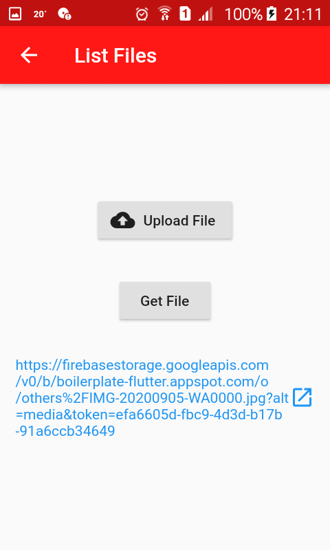 | 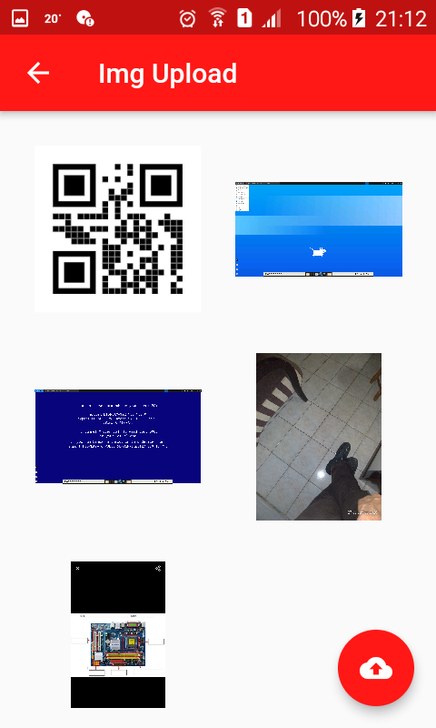 


# References
- [Flutter](https://flutter.dev/)
- [Dart/Flutter packages](https://pub.dev/)
- [Firebase Auth](https://pub.dev/packages/firebase_auth)
- [Google Sign In](https://pub.dev/packages/google_sign_in)