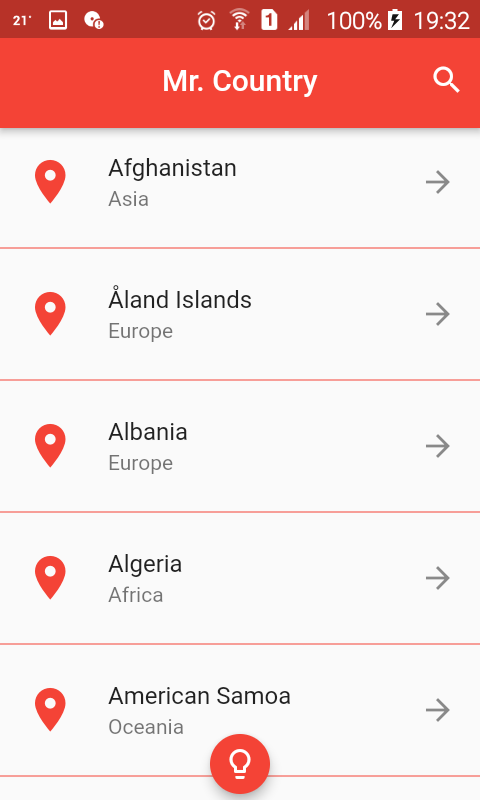
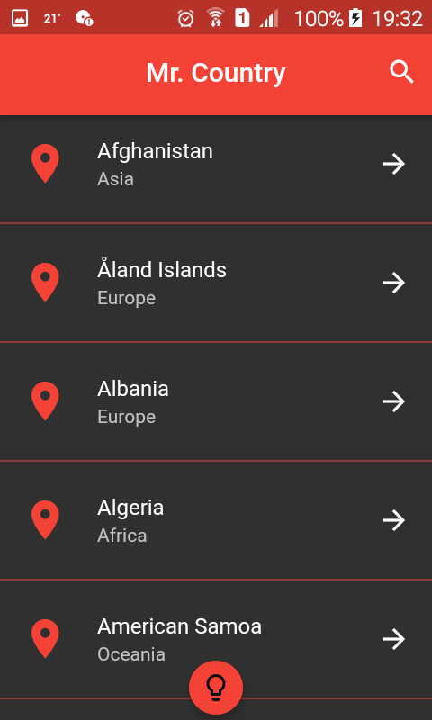
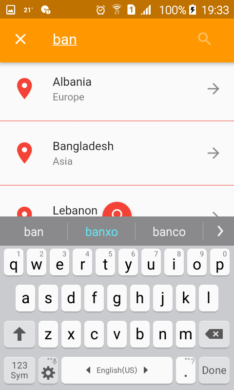
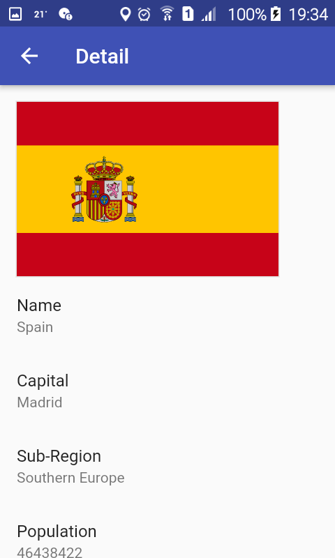

# MrCountry

Projects created with flutter

# Requirements
1. [Flutter](https://flutter.dev/docs/get-started/install)
2. [Android Studio](https://developer.android.com/studio)

# Android Apk
**https://github.com/stdioh321/flutter-test/releases**

# Setup
```
$ git clone https://github.com/stdioh321/flutter-test.git
$ cd flutter-test/mrcountry
```
# Run
```
$ flutter clean
$ flutter pub get
$ flutter run
```
|List   |Dark mode    
:------:|:-------------:
 | 


|Search |Detail 
:---------:|:----:
 | |

# References
- [Flutter](https://flutter.dev/)
- [Dart/Flutter packages](https://pub.dev/)
- [Rest Countries](https://restcountries.eu/)