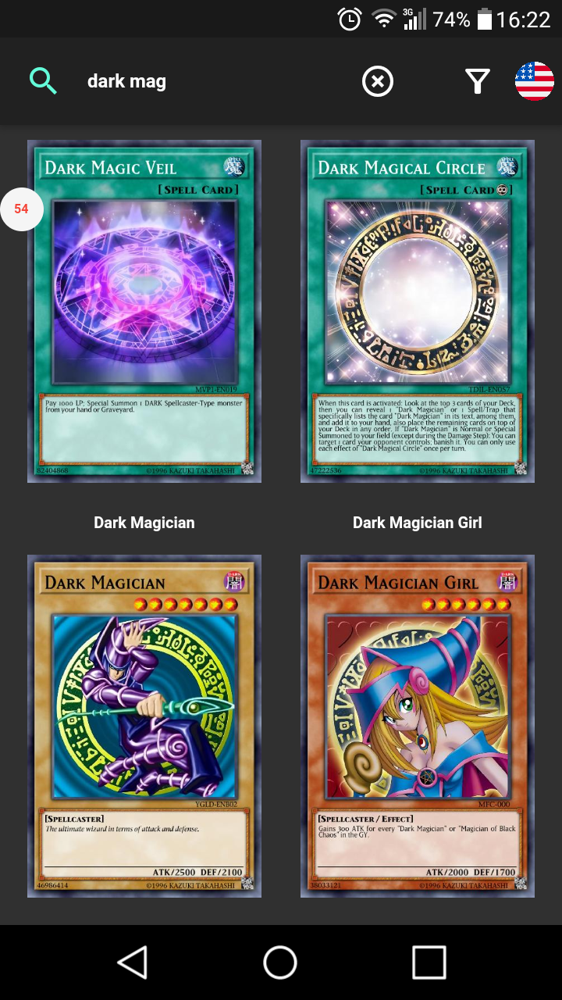
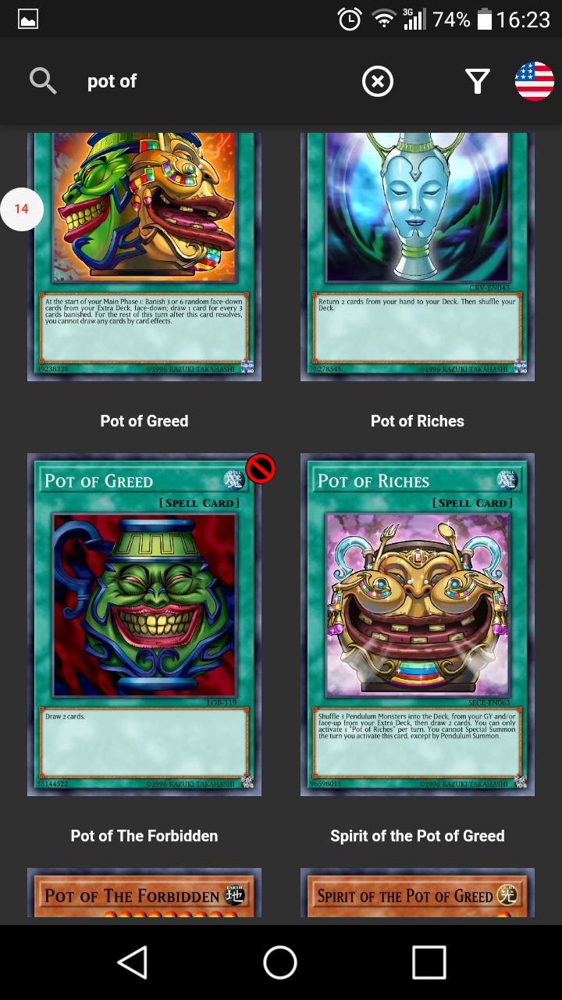
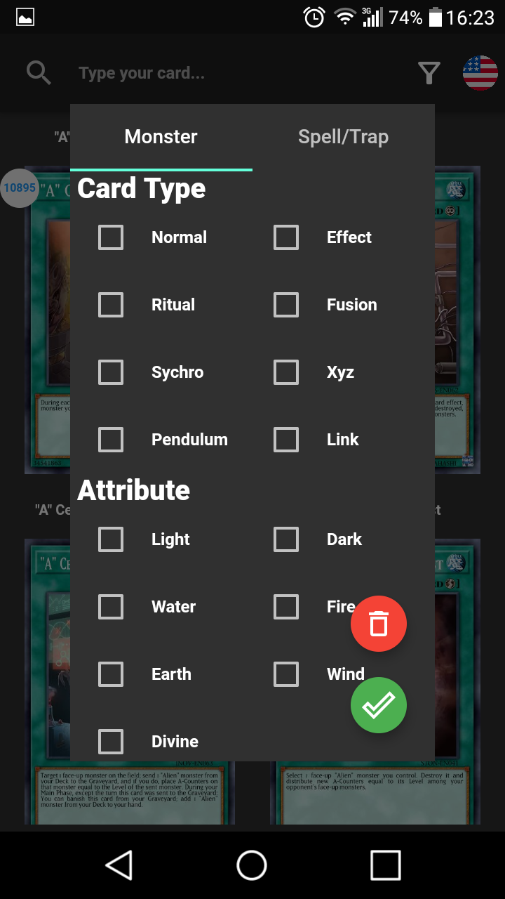
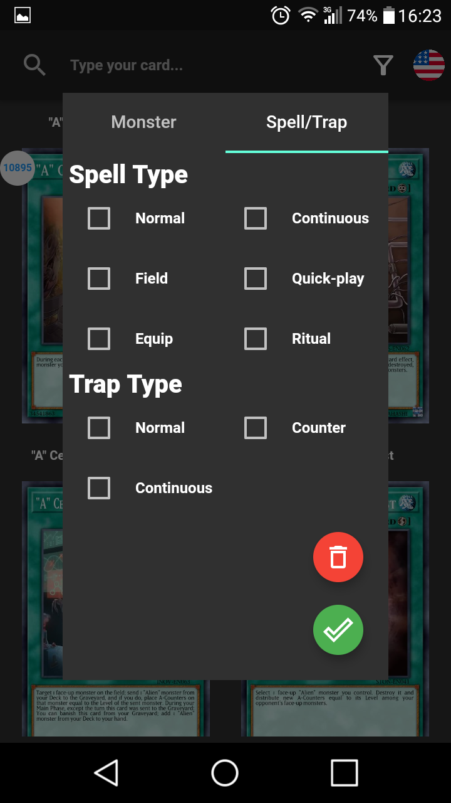
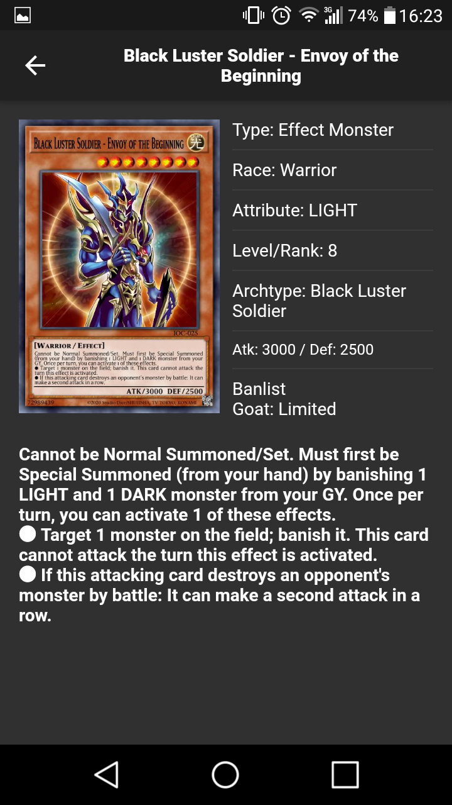
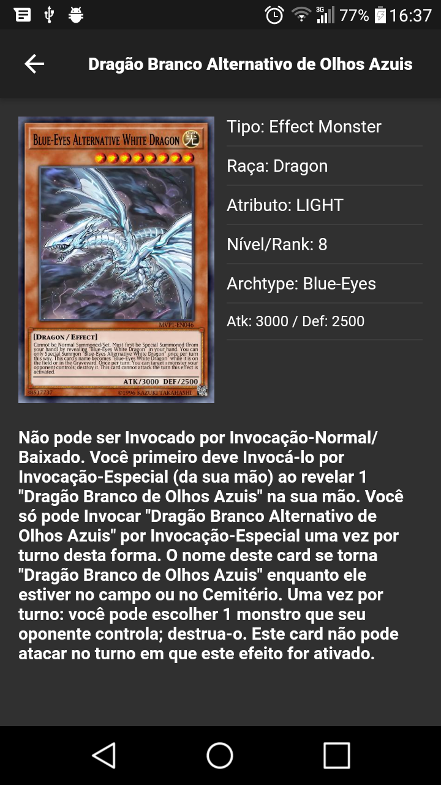

# YgoCards

Projects created with flutter.<br/>
Search and find your favorites

# Demo Web
**[https://ygocards.netlify.app/](https://ygocards.netlify.app/)**

# Requirements
1. [Flutter](https://flutter.dev/docs/get-started/install)
2. [Android Studio](https://developer.android.com/studio)

# Android Apk
**https://github.com/stdioh321/flutter-test/releases/download/0.0.1/ygocards_1.0.0_unsigned.apk**

# Setup
```
$ git clone https://github.com/stdioh321/flutter-test.git
$ cd flutter-test/ygo
```
# Run
```
$ flutter clean
$ flutter pub get
$ flutter run
```
|List/Search   |Banlist    
:------:|:-------------:
 | 


|Filter Monsters |Filters Spell/Traps 
:---------:|:----:
 | |

|Details |Internationalization 
:---------:|:----:
 | |


# References
- [YgoProDeck Api](https://db.ygoprodeck.com/api-guide/)
- [Flutter](https://flutter.dev/)
- [Dart/Flutter packages](https://pub.dev/)
- [Flutter Material Color Picker](https://pub.dev/packages/flutter_material_color_picker)